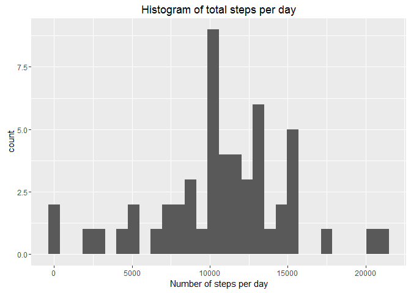
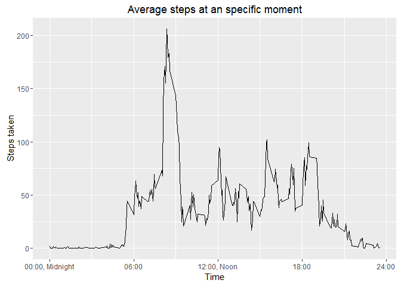
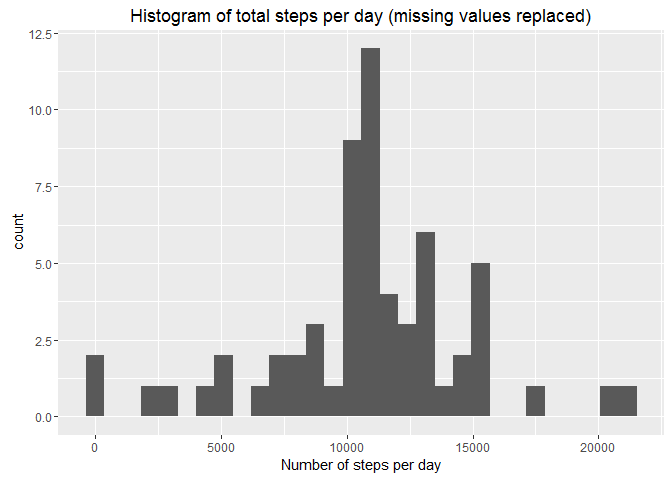
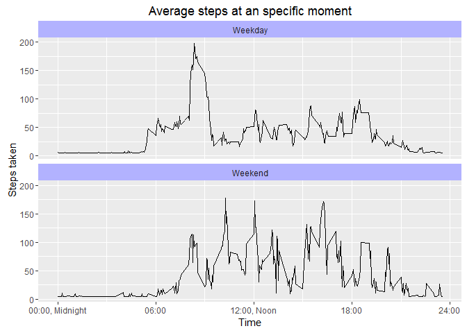

# Reproducible Research: Peer Assessment 1
Peter D. Bolier  
June 24, 2016  


First we have to ensure the locale is correct, lets ensure all is in english....

```r
Sys.setlocale("LC_ALL","English")
```

```
## [1] "LC_COLLATE=English_United States.1252;LC_CTYPE=English_United States.1252;LC_MONETARY=English_United States.1252;LC_NUMERIC=C;LC_TIME=English_United States.1252"
```


## Loading and preprocessing the data
Assume we're in the correct working directory.
The data to be processed is in activity.zip in 'root'of assignment. Lets unzip and read the data.
We use a helper function to coerce the text into a date...


```r
unzip("activity.zip");

setClass('myDate');
setAs("character","myDate", function(from) as.Date(from, format="%Y-%m-%d"));

activities <- read.csv("activity.csv", header=TRUE, sep=",", colClasses = c("integer", "myDate", "integer"));
```


## What is mean total number of steps taken per day?

We could calculate the mean for each day in one step, however we start by determining the total number of steps for each day and plot those in a histogram. 

First, lets see what the data looks like, just the first few rows.


```r
head(activities);
```

```
##   steps       date interval
## 1    NA 2012-10-01        0
## 2    NA 2012-10-01        5
## 3    NA 2012-10-01       10
## 4    NA 2012-10-01       15
## 5    NA 2012-10-01       20
## 6    NA 2012-10-01       25
```

So, the first column is the number of steps; we use that in our calculation of the totals:
We determine the total per day and the total steps measured.


```r
totalsteps <- aggregate(activities[,1], by = list(activities$date), sum);
sum(totalsteps$x, na.rm=TRUE)
```

```
## [1] 570608
```

Now we use the total in our historgram...

```r
library(ggplot2);
ggplot(totalsteps, aes(totalsteps$x)) + 
  geom_histogram() + 
  labs(title="Histogram of total steps per day", x="Number of steps per day");
```

<!-- -->

The mean and median of the total steps per day are:

```r
meansteps   <- mean(totalsteps$x, na.rm = TRUE);
meansteps;
```

```
## [1] 10766.19
```

```r
mediansteps <- median(totalsteps$x, na.rm = TRUE);
mediansteps;
```

```
## [1] 10765
```

## What is the average daily activity pattern?

The steps taken are measured at an interval of 5 minutes, we can use this to see how many steps were taken, on avarage, at a particular interval or moment. One expects less steps at night...


```r
library(scales)
averageatinterval <- aggregate(steps ~ interval, activities , mean, na.rm=TRUE);

ggplot(averageatinterval,aes(interval, steps)) +
  geom_line() + 
  labs(title="Average steps at an specific moment", x="Time", y="Steps taken") + 
  scale_x_continuous(breaks=c(0, 600, 1200, 1800, 2400), 
                     labels=c("00:00, Midnight",  "06:00", "12:00, Noon", "18:00", "24:00"))
```

<!-- -->

Determine the interval/moment of the maximum mean number of steps taken...
The number of steps is x, the interval is Group.1


```r
themoment  <- averageatinterval[averageatinterval$steps == max(averageatinterval$steps),]$interval;
themoment;
```

```
## [1] 835
```

The interval at wich the maximum average of steps taken is at 835.


## Imputing missing values

Check how many values are missing:


```r
sum(is.na(activities))
```

```
## [1] 2304
```

Replace missing values with the mean number of steps per day divided over the number of intervals.
One interval is 5 minutes. So total number of intervals is total number of minutes on one day divided over the interval.


```r
numberofintervals <- 24 * 60 / 5;
activities2 <- activities;
activities2[is.na(activities2$steps),]$steps <- (meansteps / numberofintervals);
```

Lets see what impact this has. The total number of steps has increased...


```r
totalsteps2 <- aggregate(activities2[,1], by = list(activities2$date), sum);
sum(totalsteps2$x);
```

```
## [1] 656737.5
```

Now we use the total in our historgram...

```r
library(ggplot2);
ggplot(totalsteps2, aes(totalsteps2$x)) + 
  geom_histogram() + 
  labs(title="Histogram of total steps per day (missing values replaced)", x="Number of steps per day");
```

<!-- -->

The mean and median of the total steps per day are:

```r
meansteps2 <- mean(totalsteps2$x);
meansteps2;
```

```
## [1] 10766.19
```

```r
mediansteps2 <- median(totalsteps2$x);
mediansteps2;
```

```
## [1] 10766.19
```

So it looks like imputing the missing value with a mean has not much impact.


```r
diffmean   <- meansteps   - meansteps2;
diffmedian <- mediansteps - mediansteps2;
```
The difference in the mean of the steps per day is 0 and difference in median -1.1886792.


## Are there differences in activity patterns between weekdays and weekends?

So first we add a column to the dataframe indicating whether a day is in a weekend or not...
Note: could use posix weekday number, so we dont depend on the locale...


```r
activities2$typeofday <- factor(weekdays(activities2$date) %in% c('Saterday','Sunday'), levels=c('FALSE', 'TRUE'), labels=c('Weekday', 'Weekend')) 
```

So lets separate the weekend from the other days, see if the number of steps differ at the same interval.
First calculate the evarage for a given interval and the type of the day (weekend or weekday)...


```r
grouped <- aggregate(steps ~ interval + typeofday, activities2 , mean);
```

Lets plot the two types of day in one plot... (2 rows, 1 column)


```r
ggplot(grouped, aes(interval, steps)) +
  geom_line() +
  facet_wrap(~typeofday, ncol=1) +
  labs(title="Average steps at an specific moment", x="Time", y="Steps taken") + 
  scale_x_continuous(breaks=c(0, 600, 1200, 1800, 2400), 
                     labels=c("00:00, Midnight",  "06:00", "12:00, Noon", "18:00", "24:00")) +
  theme(strip.background = element_rect(fill = alpha('blue', 0.3)))
```

<!-- -->

